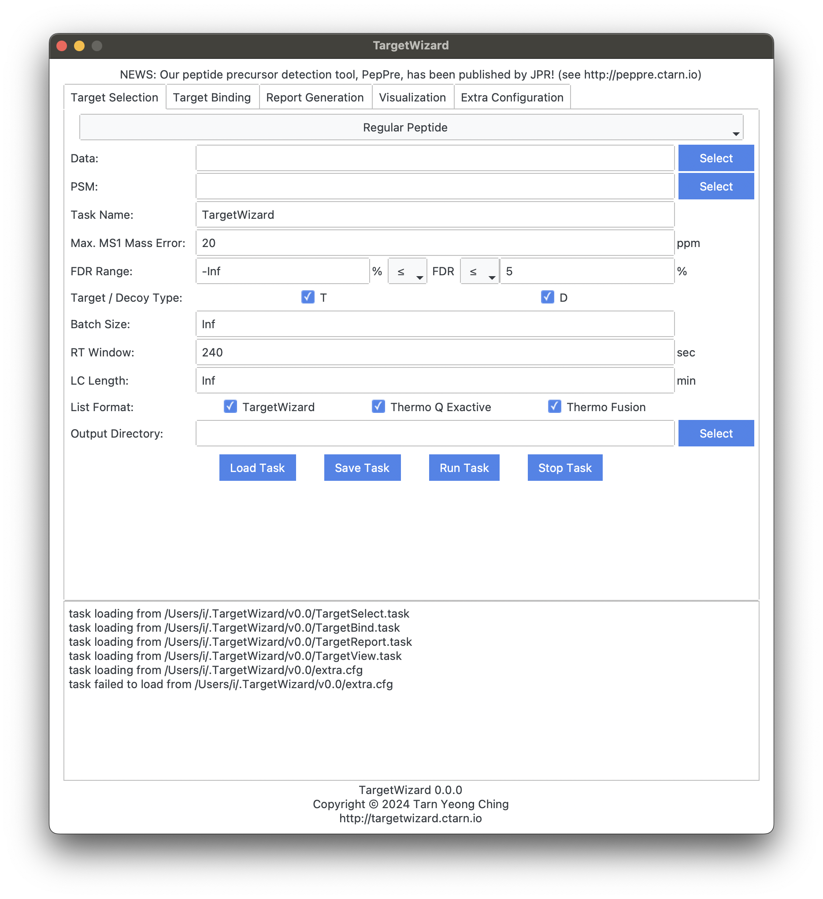

# [Start Guide](@id guide)

```@contents
Pages = ["guide.md"]
Depth = 2:3
```

## [Installation](@id install)
### Linux
Please download the software from [https://targetwizard.ctarn.io](https://targetwizard.ctarn.io).

Please unzip the downloaded `.zip` file, and TargetWizard can be used directly without installation.

### macOS
Please download the software from [https://targetwizard.ctarn.io](https://targetwizard.ctarn.io).

For macOS users, we provide both `.pkg` and `.zip` files.

We would recommend to use the `.pkg` file which can be installed by simply double clicking it.
The software would be installed at `/Applications/TargetWizard.app` by default.

The `.zip` file contains the `.app` package software and can be used directly without installation.
If the macOS says:

```
“TargetWizard.app” is damaged and can’t be opened. You should move it to the Trash.
```

Please run 
```sh
sudo xattr -r -d com.apple.quarantine [path/to/TargetWizard.app]
```
in terminal to remove the quarantine attributions.

### Windows
Please download the software from [https://targetwizard.ctarn.io](https://targetwizard.ctarn.io).

Please unzip the downloaded `.zip` file, and TargetWizard can be used directly without installation.

The software is packaged using PyInstaller,
and can be detected as virus by mistake on Windows (see [the issue](https://github.com/pyinstaller/pyinstaller/issues/5932)).
Please restore the deleted file from `Protection History`,
and Windows Security should not stop or delete it again.
Otherwise,
please add the software to white list.
You can also package the software from source yourself.

## [Usages](@id usage)
The software can be used in four ways:
- Graphic User Interface
- Command Line
- Source Code
- Julia Package

### Graphic User Interface
The software provides an easy-to-use graphic user interface, as shown below:


### Command Line
In addition to the GUI, the software provides executables that can be called directly from the command line to facilitate large-scale use.

For macOS, the executables are located at `path/to/TargetWizard.app/Contents/MacOS/content/TargetWizard/bin/`, and for Linux and Windows, they are located at `path/to/TargetWizard/content/TargetWizard/bin/`

For each executable, use `--help` for respective usage.
```sh
$ ./TargetSelect --help
usage: TargetSelect --psm PSM [-o ./out/] [--name name] [--error ppm]
                    [--fdr_min min] [--fdr_max max] [--fdr_ge]
                    [--fdr_le] [--td T,D] [--batch num] [--rtime sec]
                    [--lc min] [--fmt TW,TmQE,TmFu] [-h] data...

positional arguments:
  data                list of .umz or .ms1/2 files; .ms2/1 files
                      should be in the same directory for .ms1/2

optional arguments:
  --psm PSM           pFind PSM file (full list)
  -o, --out ./out/    output directory (default: "./out/")
  --name name         task name (default: "TargetWizard")
  --error ppm         m/z error (default: "20.0")
  --fdr_min min       min. FDR (%) (default: "-Inf")
  --fdr_max max       max. FDR (%) (default: "Inf")
  --fdr_ge            include min. FDR (compared with `≥ min` instead
                      of `> min`)
  --fdr_le            include max. FDR (compared with `≤ max` instead
                      of `< max`)
  --td T,D            target/decoy types (split by `,`) (default:
                      "T,D")
  --batch num         batch size (default: "Inf")
  --rtime sec         retention time window (sec) (default: "240")
  --lc min            LC gradient length (min) (default: "Inf")
  --fmt TW,TmQE,TmFu  format(s) of target list (split by `,`)
                      TW: TargetWizard, TmQE: Thermo Q Exactive, TmFu:
                      Thermo Fusion (default: "TW,TmQE,TmFu")
  -h, --help          show this help message and exit
```

### Source Code
You can also use or modify the source code directly. The source code can also be download from [http://targetwizard.ctarn.io](http://targetwizard.ctarn.io). You need to set up the Julia environment to run the source code. Please see the [guide](@ref dev).

The source code can be called using:
```sh
$ julia src/TargetSelect.jl --help
usage: TargetSelect --psm PSM [-o ./out/] [--name name] [--error ppm]
                    [--fdr_min min] [--fdr_max max] [--fdr_ge]
                    [--fdr_le] [--td T,D] [--batch num] [--rtime sec]
                    [--lc min] [--fmt TW,TmQE,TmFu] [-h] data...

positional arguments:
  data                list of .umz or .ms1/2 files; .ms2/1 files
                      should be in the same directory for .ms1/2

optional arguments:
  --psm PSM           pFind PSM file (full list)
  -o, --out ./out/    output directory (default: "./out/")
  --name name         task name (default: "TargetWizard")
  --error ppm         m/z error (default: "20.0")
  --fdr_min min       min. FDR (%) (default: "-Inf")
  --fdr_max max       max. FDR (%) (default: "Inf")
  --fdr_ge            include min. FDR (compared with `≥ min` instead
                      of `> min`)
  --fdr_le            include max. FDR (compared with `≤ max` instead
                      of `< max`)
  --td T,D            target/decoy types (split by `,`) (default:
                      "T,D")
  --batch num         batch size (default: "Inf")
  --rtime sec         retention time window (sec) (default: "240")
  --lc min            LC gradient length (min) (default: "Inf")
  --fmt TW,TmQE,TmFu  format(s) of target list (split by `,`)
                      TW: TargetWizard, TmQE: Thermo Q Exactive, TmFu:
                      Thermo Fusion (default: "TW,TmQE,TmFu")
  -h, --help          show this help message and exit
```

### Julia Package
The source code can also be imported as a Julia package. You should first set up the Julia environment, download the source code, and then register the package:
```sh
$ julia
               _
   _       _ _(_)_     |  Documentation: https://docs.julialang.org
  (_)     | (_) (_)    |
   _ _   _| |_  __ _   |  Type "?" for help, "]?" for Pkg help.
  | | | | | | |/ _` |  |
  | | |_| | | | (_| |  |  Version 1.10.4 (2024-06-04)
 _/ |\__'_|_|_|\__'_|  |  Official https://julialang.org/ release
|__/                   |

(@v1.10) pkg> dev path/to/TargetWizard.jl
   Resolving package versions...
    Updating `~/.julia/environments/v1.10/Project.toml`
  [faeafb7a] + TargetWizard v1.0.0 `path/to/TargetWizard.jl`
    Updating `~/.julia/environments/v1.10/Manifest.toml`
  [faeafb7a] + TargetWizard v1.0.0 `path/to/TargetWizard.jl`
```

Then the package can be imported through:
```sh
$ julia
               _
   _       _ _(_)_     |  Documentation: https://docs.julialang.org
  (_)     | (_) (_)    |
   _ _   _| |_  __ _   |  Type "?" for help, "]?" for Pkg help.
  | | | | | | |/ _` |  |
  | | |_| | | | (_| |  |  Version 1.10.4 (2024-06-04)
 _/ |\__'_|_|_|\__'_|  |  Official https://julialang.org/ release
|__/                   |

julia> import TargetWizard

julia> TargetWizard.TargetSelect.build_target
build_target (generic function with 1 method)

julia> methods(TargetWizard.TargetSelect.build_target)
# 1 method for generic function "build_target" from TargetWizard.TargetSelect:
 [1] build_target(df, Ms, paths, out, name, ε, batch_size, rt, lc, fmt)
     @ path/to/TargetWizard.jl/src/util.jl:36

julia> 
```

## [Frequently Asked Questions](@id faq)
- macOS says: “TargetWizard.app” is damaged and can’t be opened. You should move it to the Trash.

Please run `sudo xattr -r -d com.apple.quarantine [path/to/TargetWizard.app]` in terminal.

- Windows Security stops the software and deletes the .exe file. 

The software is packaged using PyInstaller,
and can be detected as virus by mistake on Windows (see [the issue](https://github.com/pyinstaller/pyinstaller/issues/5932)).
Please restore the deleted file from `Protection History`,
and Windows Security should not stop or delete it again.
Otherwise,
please add the software to white list.
You can also package the software from source yourself.
