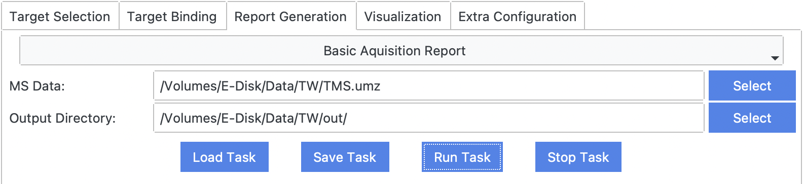
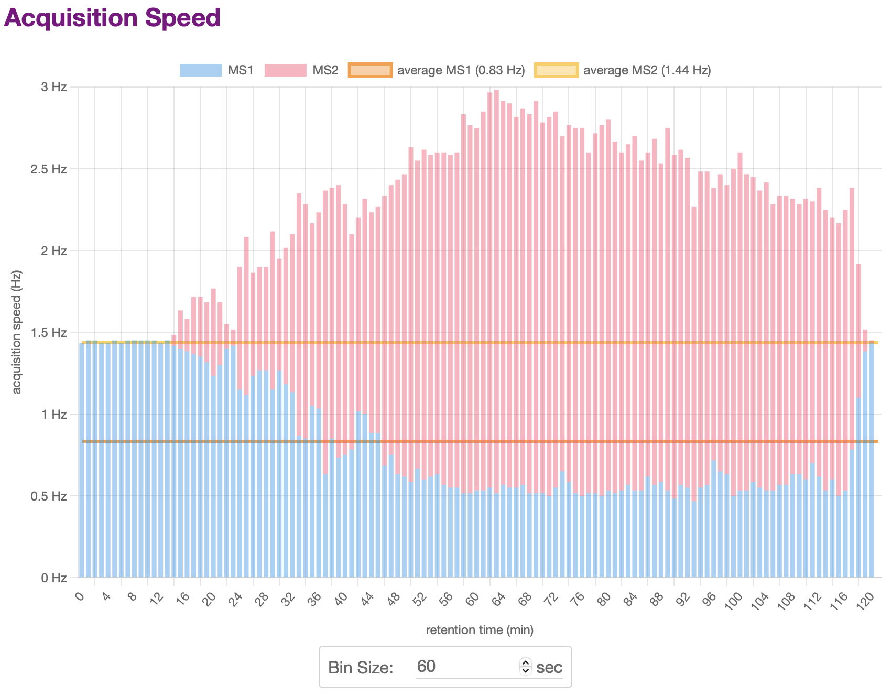
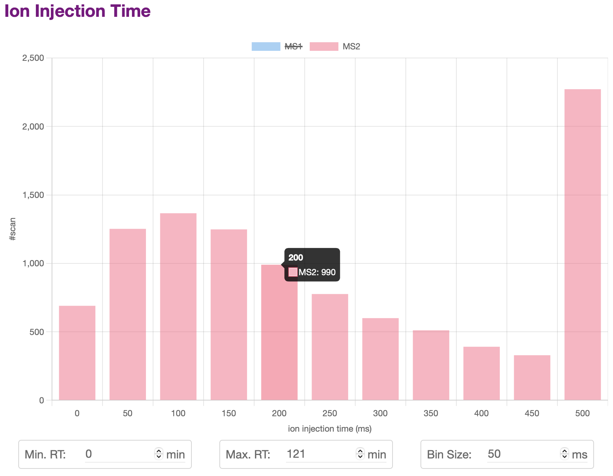

# [Basic Acquisition Report](@id report_ba)

## Requirements
- traditional or targeted mass spectrometry data, e.g., `TMS.raw`.
  - The raw data should be converted into an open-source format such as MS1/MS2. [ThermoRawRead](http://thermorawread.ctarn.io) is recommended.

## Output Results
Once finished, TargetWizard will save a report to `Output Directroy`, and open the report automatically in a web browser.
- `html` report, e.g., `BasicAcquisitionReport.html` ([example](../../assets/report/BasicAcquisitionReport.html)).

## Usage

## Example
The report will show statistics plots of the MS data, including:
- Acquisition Speed
- Activation Center
- Ion Injection Time
- Total Ion Current (TIC), Base Peak Intensity (BPI), Base Peak Mass (BPM)
- …

For many plots, you can change the settings including RT range, barplot bin size, etc.
The plot will be updated automatically.

You can also click the legend of a plot to hide or display some items.

