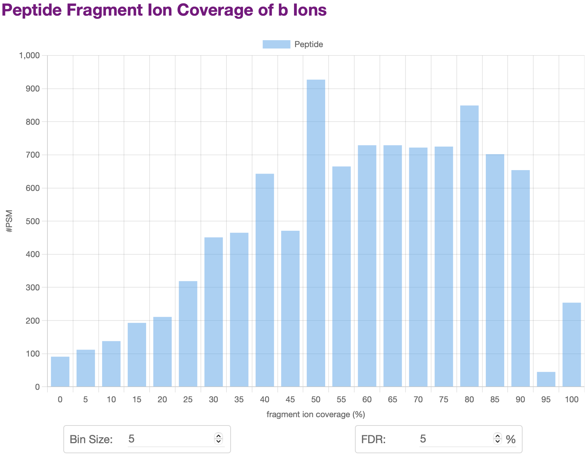

# [Peptide Coverage Report](@id report_pc)

## Requirements
- (filtered) identification results of targeted mass spectrometry data, e.g., `TMS_fdr.pfind.csv`.
- traditional or targeted mass spectrometry data, e.g., `TMS.raw`.
  - The raw data should be converted into an open-source format such as MS1/MS2. [ThermoRawRead](http://thermorawread.ctarn.io) is recommended.

## Output Results
Once finished, TargetWizard will save reports to `Output Directroy`, and open a `html` report automatically in a web browser.
- `html` report, e.g., `PeptideCoverageReport.html` ([example](../../assets/report/PeptideCoverageReport.html)).
- `csv` report including detailed fragment information.

## Usage

## Example
The report will show statistics plots of the MS data, including:
- Overall Peptide Coverage Distribution
- Peptide Coverage Distribution of Specific Ion Types
- …

For many plots, you can change the settings including barplot bin size, FDR, etc.
The plot will be updated automatically.

You can also click the legend of a plot to hide or display some items.

