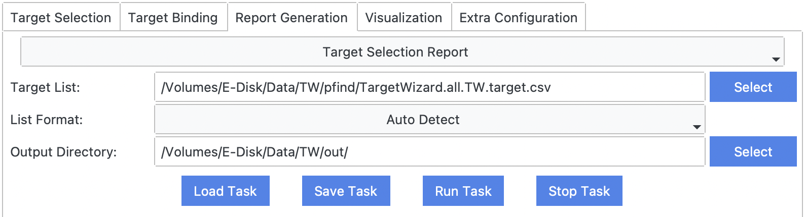

# [Target Selection Report](@id report_ts)

## Requirements
- target list (multiple formats supported), e.g., `TargetWizard.all.TW.target.csv`.

## Output Results
Once finished, TargetWizard will save a report to `Output Directroy`, and open the report automatically in a web browser.
- `html` report, e.g., `TargetSelectionReport.html` ([example](../../assets/report/TargetSelectionReport.html)).

## Usage

## Example
The report will show statistics plots of the MS data, including:
- Acquisition Load
- Charge State Distribution
- Mass Distribution
- …

For many plots, you can change the settings including RT range, barplot bin size, etc.
The plot will be updated automatically.

You can also click the legend of a plot to hide or display some items.

