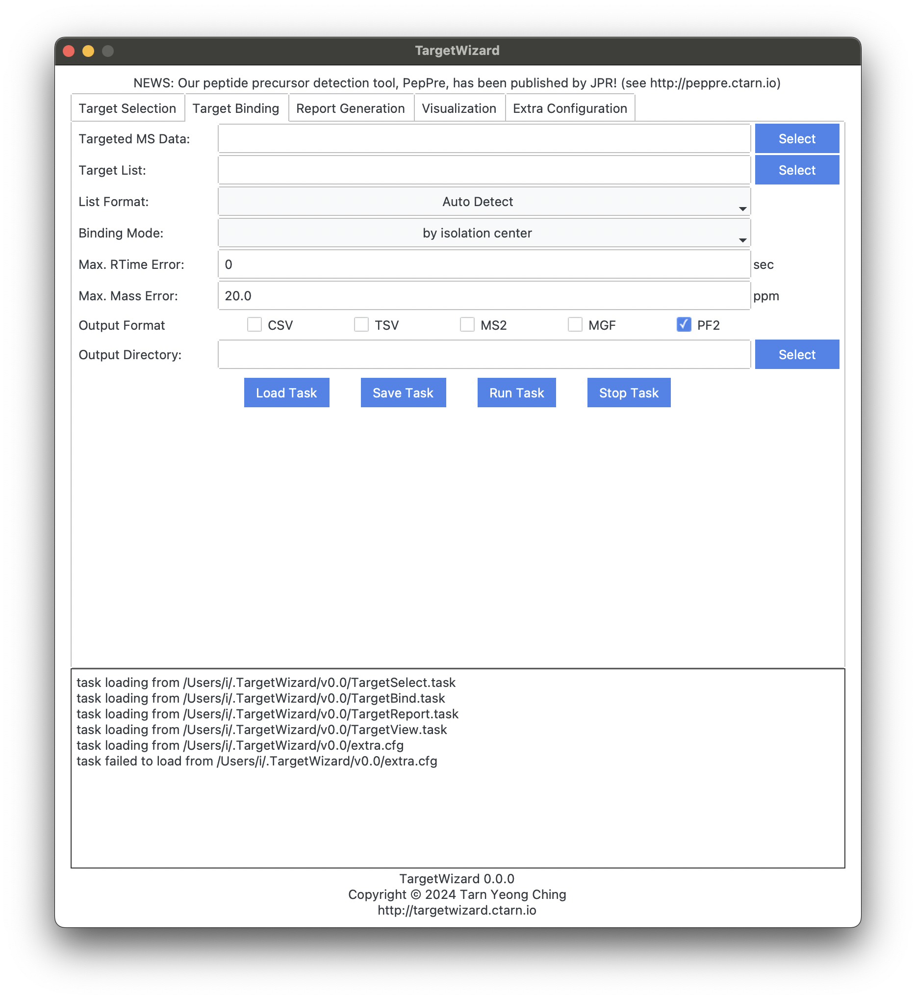

# [Proteomics Analysis Tutorial](@id tutorial_prot)

## Requirements
- traditional mass spectrometry data, e.g., DDA.raw
- PSM search results of pFind, e.g., DDA.psm.csv or pFind-filtered.spectra

## Preprocessing
#### MS Data Format
The raw data should be converted into an open-source format such as MS1/MS2.
Using [ThermoRawRead](http://thermorawread.ctarn.io) is recommended.

#### PSM
The PSM list can be used as-is.
If you are interested in specific identifications, e.g., phosphopeptide, it’s ok to filter the list manually.

## Target Selection
TargetWizard provides the `TargetSelect` feature to generate a target list (a.k.a., inclusion list) for further MS data acquisition.
As shown in the following GUI, you can filter the PSM list by FDR value, and/or Target-Decoy type.

The parameters are described as below:
#### Data
MS Data

#### PSM
PSM level identification results.

#### Task Name
appeared in output results.

#### Max. MS1 Mass Error
used to match PSMs and MS1 peaks.

#### FDR Range
used to filter PSMs. `Inf` and `-Inf` are also valid. For example, `-Inf % ≤ FDR ≤ Inf %` will not remove any PSM.

#### Target / Decoy Type
`T` for Target, `D` for Decoy.

#### Batch Size
Max batch size of each data acquisition size.
`Inf` is also valid. It controls the load of each data acquisition, and TargetWizard will split the task into batches automatically.

#### RT Window
Retention time window size for targeted acquisition.
The RT values are estimated using PSM and MS1.
The size is the total length, instead of radius.

#### List Format
TargetWizard Support three formats:
- TargetWizard: most detailed format, including many useful information.
- Thermo Q Exactive: format can be used directly by Thermo Q Exactive instrument.
- Thermo Fusion: format can be used directly by Thermo Fusion instrument.

#### Output Directory
where output results are saved to.

## Target Binding
TargetWizard provides three strategies to bind targets and MS data acquired using the target list.
The feature exports various MS formats including MS2, MGF, and PF2, which can be used for further analysis.
You can use the exported data for further identification.
The matched targets are used as precursor ions of these MS2 scans.

The parameters are described as below:
#### Targeted MS Data
MS data acquired using the target list

#### Target List
previously generated list of interested targets.

#### List Format
Four options are available:
- Auto Detect
- TargetWizard
- Thermo Q Exactive
- Thermo Fusion

#### Binding Mode
Three options are available:
- by isolation center: match targets and MS2 scans when targets are isolation centers of these MS2 scans.
- by isolation window: match targets and MS2 scans when targets are in isolation windows of these MS2 scans.
- by extended isolation window: similar to `by isolation window` but extend the windows to the left by 1 Th so that incompleted precursor isotope clusters can also be considered for identification.

#### Max. RTime Error
When setting the error to zero, only match targets and MS2 scans when scans are in the RT window of the targets.
The RT window will be extended by setting the error to larger values.

#### Max. Mass Error
Mass Error for targets and MS2 scans.
Used when the mode is set to `by isolation center` only.

#### Output Format
- CSV
- TSV
- MS2
- MGF
- PF2

#### Output Directory
where output results are saved to.

## Analysis Reports
TargetWizard can generate various reports automatically to assist with targeted proteomics analysis.
- Basic Acquisition Report
- Target Selection Report
- Target Acquisition Report
- Peptide Coverage Report

For details of these reports, please see the [manual](@ref report).

## Interactive Visualization
In addition to the static reports, TargetWizard provides an interactive visualization feature to help with insightful case studies.
- Regular Peptide View

For details of these reports, please see the [manual](@ref view).
