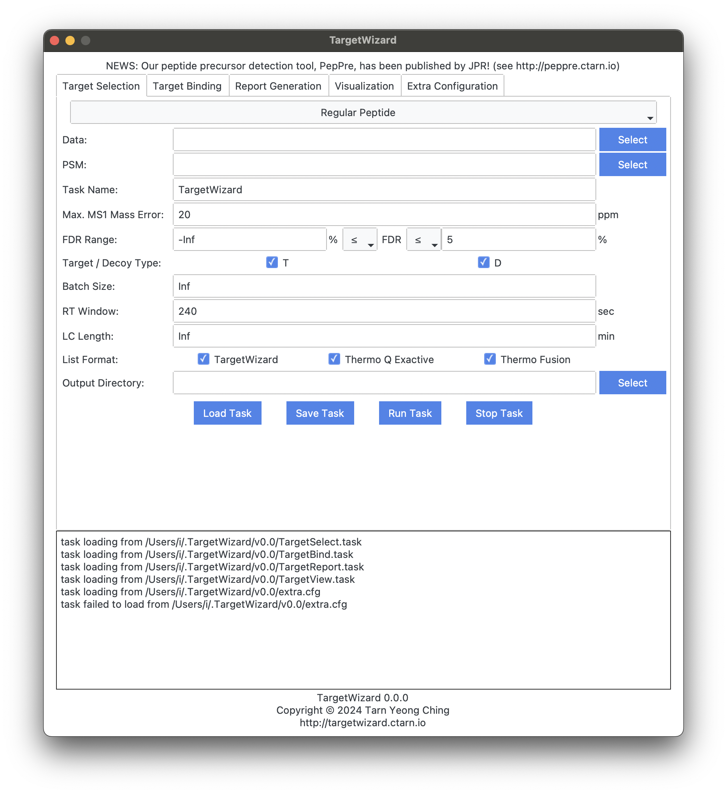

# [Proteomics Analysis Tutorial](@id tutorial_prot)

## Requirements
- traditional mass spectrometry data, e.g., DDA.raw
- PSM search results of pFind, e.g., DDA.psm.csv or pFind-filtered.spectra

## Preprocessing
#### MS Data Format
The raw data should be converted into an open-source format such as MS1/MS2.
Using [ThermoRawRead](http://thermorawread.ctarn.io) is recommended.

#### PSM
The PSM list can be used as-is.
If you are interested in specific identifications, e.g., phosphopeptide, it’s ok to filter the list manually.

## Target Selection
TargetWizard provides the `TargetSelect` feature to generate a target list (a.k.a., inclusion list) for further MS data acquisition.
As shown in the following GUI, you can filter the PSM list by FDR value, and/or Target-Decoy type.

The parameters are described as below:
#### Data
MS Data

#### PSM
PSM level identification results.

#### Task Name
appeared in output results.

#### Max. MS1 Mass Error
used to match PSMs and MS1 peaks.

#### FDR Range
used to filter PSMs. `Inf` and `-Inf` are also valid. For example, `-Inf % ≤ FDR ≤ Inf %` will not remove any PSM.

#### Target / Decoy Type
`T` for Target, `D` for Decoy.

#### Batch Size
Max batch size of each data acquisition size.
`Inf` is also valid. It controls the load of each data acquisition, and TargetWizard will split the task into batches automatically.

#### RT Window
Retention time window size for targeted acquisition.
The RT values are estimated using PSM and MS1.
The size is the total length, instead of radius.

#### List Format
TargetWizard Support three formats:
- TargetWizard: most detailed format, including many useful information.
- Thermo Q Exactive: format can be used directly by Thermo Q Exactive instrument.
- Thermo Fusion: format can be used directly by Thermo Fusion instrument.

#### Output Directory
where output results are saved to.

